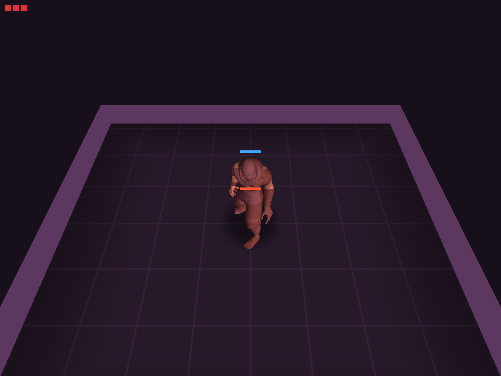
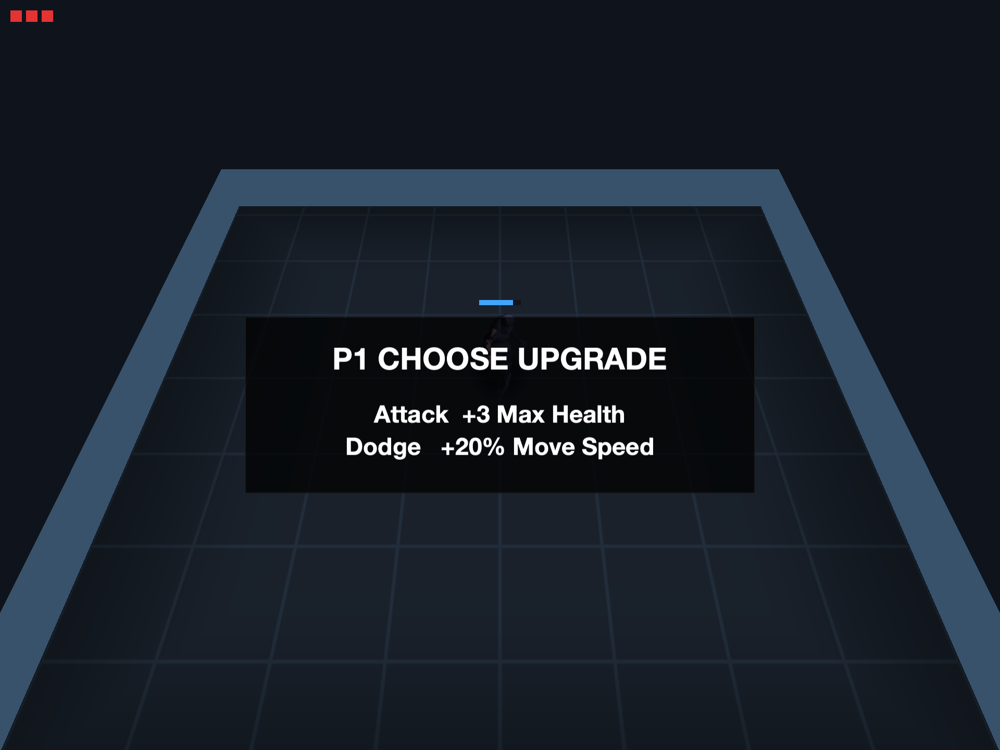

# MetalBrawler

[](https://github.com/monomial/MetalBrawler/actions/workflows/ci.yml)

A top-down roguelike brawler built from scratch in **raw Metal + Objective-C/C++** — no game engine. One shared simulation and renderer drive native apps for **macOS, iOS, and tvOS**.

| Boss room | Perk choice between rooms |
|---|---|
|  |  |

## Features

- Hand-rolled C++ ECS with a deterministic 120 Hz fixed-tick simulation (seedable RNG — identical seed, identical run)
- Combat feel: 2-hit combos, hit-stop, knockback, screen shake, radial hit blur, haptics
- GPU-skinned characters (Mixamo → USDZ pipeline via Blender), animation cross-fades, death dissolve
- Enemy archetypes (Grunt / Rusher / Heavy) plus a boss with a telegraphed charge and lava-snake ground hazards
- Roguelike runs: 6 rooms with seeded shuffle, per-player perk picks between rooms, up to 4 players
- Particles, blob shadows, per-room palettes, post-processing pass, synthesized SFX and battle music

## Building

Requires Xcode and [XcodeGen](https://github.com/yonaskolb/XcodeGen) (`brew install xcodegen`). Assets are stored in Git LFS, so install [git-lfs](https://git-lfs.com) before cloning.

```sh
git lfs install
git clone https://github.com/monomial/MetalBrawler.git
cd MetalBrawler
xcodegen                       # generates MetalBrawler.xcodeproj
open MetalBrawler.xcodeproj    # build the Brawler-macOS / -iOS / -tvOS scheme
```

## Controls (macOS)

| Input | Action |
|---|---|
| WASD / arrow keys | Move |
| Space | Attack (hold to combo) |
| Q | Dodge |
| Esc | Pause |
| 1 / 2 | Start 1- or 2-player game |

Player 2 uses the first connected game controller. iOS uses touch controls; tvOS uses the Siri Remote or a controller.

## Testing

The game verifies itself — an AutoPilot bot plays full seeded runs to completion:

```sh
# Logic + scenario tests (headless, no GPU): unit tests plus complete
# bot-played games asserting every phase transition
xcodebuild -project MetalBrawler.xcodeproj -scheme BrawlerLogicTests \
           -destination 'platform=macOS' test

# Visual smoke test: builds the macOS app, the bot plays a real windowed
# run to the win screen, screenshots every beat to /tmp/brawler-autotest/
./scripts/smoke.sh
```

CI runs the test suite and builds all three platform targets on every push — the badge above shows the latest result.

## Docs

- [Design doc](docs/design.md) — vision, architecture, and feel targets
- [Improvement plan](docs/improvement-plan.md) — the executed polish/content roadmap
- [ECS vocabulary](docs/ecs-vocabulary.md) — naming conventions for the simulation layer
